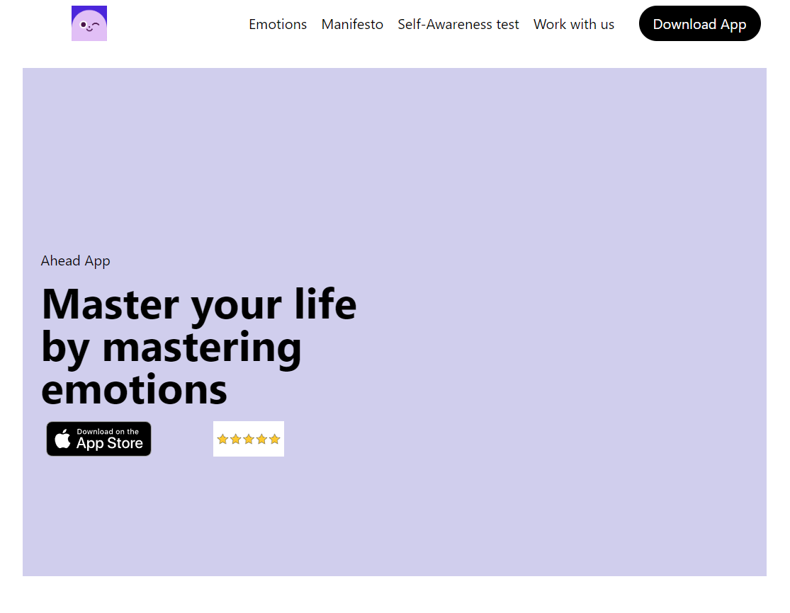
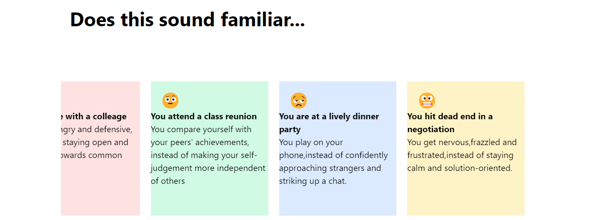
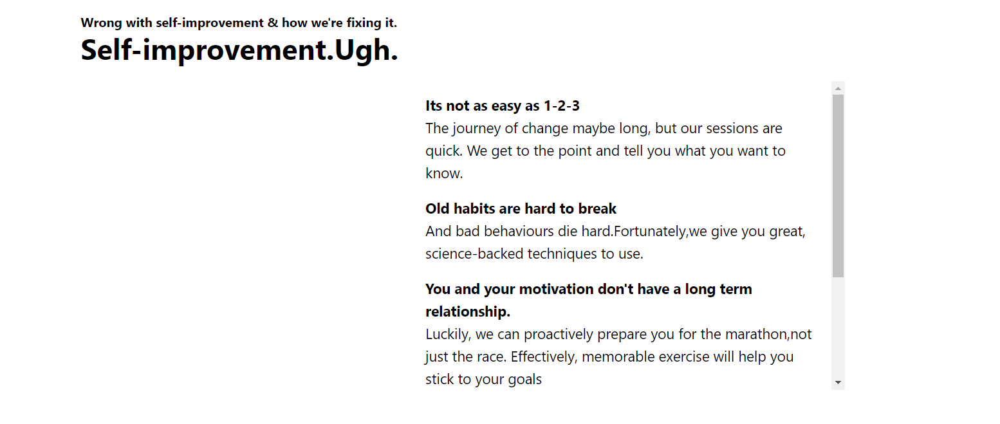

# Frontend UI Intern 
 The task was to create a webpage about the app-ahead.
 #### Deployed Link: https://frontend-ui-intern-seven.vercel.app/

 ## Description
 The webpage about the app tells what is the need of the app, how it can be prove to provide a scientific solution to our behavioural problems. Stresses over importance of EQ over IQ.
 ## This Application is made using:
 1. HTML
 2. CSS
 3. Tailwind CSS
 4. Greensock JS
## Snapshots of the Webpage
* ### Download from

   
 * ### Behavioural Dilemmas

   
   * ### Problems and their solution by ahead

   
